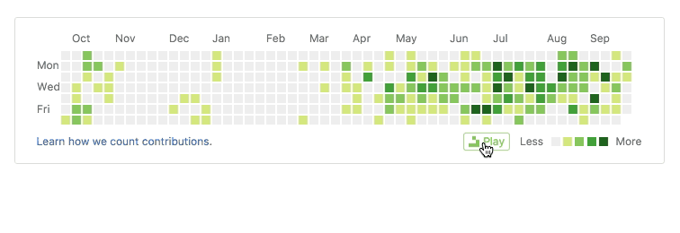
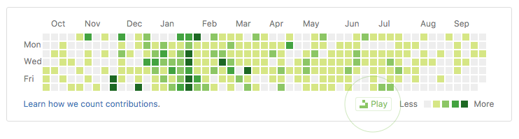

# Game of Life
> A browser extension to play [Conway's Game of Life](https://en.wikipedia.org/wiki/Conway%27s_Game_of_Life) on GitHub contribution board.

## How to play

  1. Install the extension from [Chrome Web Store](https://chrome.google.com/webstore/detail/game-of-life/bhhddgpklpjchoemcgggncekimleaaok)
  2. Click `Play` button from anyone's GitHub profile page:

  

## Patterns

  * [Gosper glider gun](http://www.conwaylife.com/wiki/Gosper_glider_gun) -- Bill Gosper 1970
  * [Lightweight spaceship](http://www.conwaylife.com/wiki/Lightweight_spaceship)-- John Conway 1970
  * [Washerwoman](http://www.conwaylife.com/wiki/Washerwoman)-- Earl Abbe 1971
  * [Ants](http://www.conwaylife.com/wiki/Ants)-- Unknown
  * [Glider](http://www.conwaylife.com/wiki/Glider)-- Richard K. Guy 1970
  * [Bi-clock](http://www.conwaylife.com/wiki/Bi-clock)-- Dale Edwin Cole 1971
  * [Beacon](http://www.conwaylife.com/wiki/Beacon)-- John Conway 1970
  * [$rats](http://www.conwaylife.com/wiki/$rats)-- David Buckingham 1972
  * [Pinwheel](http://www.conwaylife.com/wiki/Pinwheel)-- Simon Norton 1970
  * [Tumbler](http://www.conwaylife.com/wiki/Tumbler)-- George Collins 1970
  * [Bent keys](http://www.conwaylife.com/wiki/Bent_keys)-- Dean Hickerson 1989
  * [Turning toads](http://www.conwaylife.com/wiki/Turning_toads)-- Dean Hickerson 1989
  * [38P7.2](http://www.conwaylife.com/wiki/38P7.2)-- Nicolay Beluchenko 2009
  * [Blonker](http://www.conwaylife.com/wiki/Blonker)-- Nicolay Beluchenko 2004
  * [Dinner Table](http://www.conwaylife.com/wiki/Dinner_table)-- Robert Wainwright 1972
  * [Octagon 2](http://www.conwaylife.com/wiki/Octagon_2)-- Arthur Taber 1971
  * [4-8-12 diamond](http://www.conwaylife.com/wiki/4-8-12_diamond)--- Honeywell group 1971
  * [Worker bee](http://www.conwaylife.com/wiki/Worker_bee)-- David Buckingham 1972
  * [Blinker fuse](http://www.conwaylife.com/wiki/Blinker_fuse)-- Unknown
  * [Caterer](http://www.conwaylife.com/wiki/Caterer)-- Dean Hickerson 1989
  * [Pseudo-barberpole](http://www.conwaylife.com/wiki/Pseudo-barberpole)-- Achim Flammenkamp 1994
  * [Radial pseudo-barberpole](http://www.conwaylife.com/wiki/Pseudo-barberpole)-- Gabriel Nivasch
  * [Cow](http://www.conwaylife.com/wiki/Cow)-- Unknown
